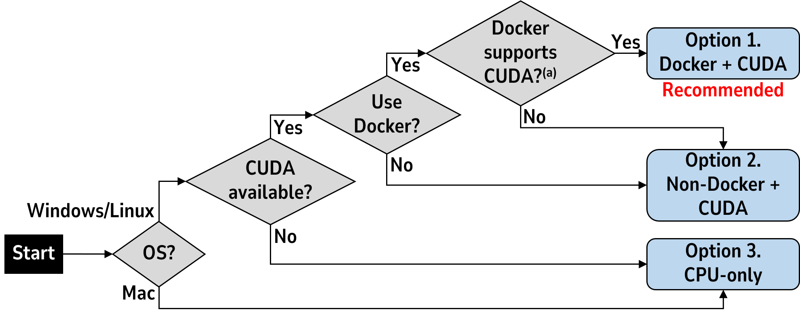

# Spatio-Focal Bidirectional Disparity Estimation from a Dual-Pixel Image

### [Project page](https://vclab.kaist.ac.kr/cvpr2023p1/index.html) | [Paper](https://vclab.kaist.ac.kr/cvpr2023p1/defocus-cvpr-main-final.pdf) | [Supplemental](https://vclab.kaist.ac.kr/cvpr2023p1/defocus-cvpr-supple-final.pdf)

[Donggun Kim](https://sites.google.com/view/dgkim1003-personal), [Hyeonjoong Jang](https://vclab.kaist.ac.kr/hjjang/index.html), [Inchul Kim](https://vclab.kaist.ac.kr/ickim/index.html), [Min H. Kim](https://vclab.kaist.ac.kr/minhkim/index.html)

**Demo code** and **captured dual-pixel blur kernel** for the paper "Spatio-Focal Bidirectional Disparity Estimation from a Dual-Pixel Image", presented at **CVPR 2023**.

```tex
@InProceedings{Kim:2023:Dualpixel,
    title = {Spatio-Focal Bidirectional Disparity Estimation from a Dual-Pixel Image},
    author = {Kim, Donggun and Jang, Hyeonjoong and Kim, Inchul and Kim, Min H.},
    booktitle = {{IEEE} Conference on Computer Vision and Pattern Recognition ({CVPR})},
    year = {2023}
}
```

## Contents
[0. Prepare](#0-prepare)

[1. Environment setup](#1-environment-setup)

[2. Run](#2-run)

[3. Dual-Pixel Blur Kernel](#3-dual-pixel-blur-kernel)

[Troubleshooting & Misc. Info](#troubleshooting--misc-info)

</br>

## 0. Prepare

### Dataset

For the dataset, we assume the following structure and root data directory path are used for the following steps.

```
/where/your/data/dir/root
├── Abuolaim_ECCV_2020 (1.3GB, canon test data only)
│   └── canon
│       ├── test_l
│       │   └── source
│       └── test_r
│           └── source
├── Punnappurath_ICCP_2020 (600 MB)
│   ├── 001_B.jpg
│   ├── 001_D.TIF
│   ├── 001_L.jpg
│   ├── 001_R.jpg
│   ├── 002_B.jpg
│   └── ...
└── Xin_ICCV_2021 (185 MB)
    ├── 001_left.png
    ├── 001_right.png
    ├── 002_left.png
    ├── ...
    └── gt_defocus_map
```

If you don't have the dataset, the download link is in the [Acknowledgement](#acknowledgement) section. If you want to use your own data, see [Using own data](#using-own-data) section.

### Checkpoint

The checkpoint is already included in this git repository (`ckpt/checkpoint.pt`, 43MB).

</br>

## 1. Environment setup

Make sure that your hardware can run PyTorch 1.11.0. We provide **3 options**. We highly recommend option 1 (Docker with CUDA GPU support) to prevent conflict with your local environment.



**(a) Docker CUDA support ([NVIDIA Container Toolkit](https://github.com/NVIDIA/nvidia-container-toolkit)): Available for Linux / Windows 11 WSL. In case of Windows 10 WSL, you need 21H2 update [[Linux reference](https://docs.nvidia.com/datacenter/cloud-native/container-toolkit/latest/install-guide.html), [Windows reference](https://learn.microsoft.com/en-us/windows/ai/directml/gpu-cuda-in-wsl)].**


<details><summary>

### Option 1. Docker + CUDA (Recommended)</summary>
Make sure you properly installed Docker CUDA support. The following command builds a docker image with `env/Dockerfile`. This may take some time.

```shell
docker build -t sfbd:v0 ./env
```

Set the path as shell variable for starting the docker container. See the data directory structure in the [Prepare dataset](#dataset) section.

Note that `$(pwd)` automatically get current directory and you have to put **your dataset directory** to `where/your/data/dir/root`.

```shell
THIS_REPOSITORY_PATH="$(pwd)"
DATA_DIR_ROOT="/where/your/data/dir/root"
```

Start the docker container. You may modify some options (e.g. `--name` for container name (2nd line), `--gpu` for gpu index (3rd line), additional `-v` option for mount volume (4th line)).

```shell
docker run -ti \
--name sfbd \
--gpus all \
-v "$THIS_REPOSITORY_PATH":/workspace/code \
-v "$DATA_DIR_ROOT":/workspace/data \
sfbd:v0
```

Now you are inside the docker container. Inside the docker container, your code exists in `/workspace/code` and data exists in `/workspace/data`.

The following command installs the remaining dependencies. Everything is prepared in the **base** environment of docker. Therefore, this does ***NOT*** create the new conda environment. 

```shell
cd /workspace/code
chmod +x env/install.sh && ./env/install.sh
```
</details>

<details><summary>

### Option 2. Non-Docker + CUDA</summary>

(**NB: This is not tested**) If you are not going to use Docker, ensure the following environment matches.

- [Pytorch 1.11.0 compatible](https://pytorch.org/get-started/previous-versions/#v1110), CUDA Toolkit version 11.3 and CuDNN 8
- [Anaconda](https://www.anaconda.com/products/distribution) installed
- (Windows) MinTTY (usually installed with Git Bash) with conda enabled, for running the following shell script

And run the following commands. ***This will create the NEW conda environment named `sfbd`***.

```shell
chmod +x env/install_conda_cuda.sh && ./env/install_conda_cuda.sh
```
</details>

<details><summary>

### Option 3. CPU-only</summary>

(**NB: This is extremely slow**) In case of CUDA-enabled GPU is not available, you can use the CPU-only version. In this case, you need an environment similar to [Option 2](#option-2-non-docker--cuda), but without CUDA support.

And run the following commands. ***This will create the NEW conda environment named `sfbd`***.

```shell
chmod +x env/install_conda_cpu.sh && ./env/install_conda_cpu.sh
```
</details>

</br>

## 2. Run

First ensure that you are in the right docker container (for option 1) and conda environment (`base` for option 1, `sfbd` for option 2 and 3).

Run demo one by one using `demo.py`. Following is one example of a running command.

```shell
python demo.py -data_name "CanonDPDepth" -save_disp -save_invdepth -l "../data/Punnappurath_ICCP_2020/*_L.jpg" -r "../data/Punnappurath_ICCP_2020/*_R.jpg" -gt "../data/Punnappurath_ICCP_2020/*_D.TIF"
```

See `demo.py` for details and input arguments and `demo_all.sh` for examples.

### Using own data

you can use the class `DPDataset` (i.e., `-data_name DPDataset`) or create your own class inheriting the `DPDataset` class. See `dpdataset.py` for more detail.

</br>

## 3. Dual-Pixel Blur Kernel

We also provide blur kernel experiment result in [kernel](./kernel) directory. See `kernel/README.md` for detail.

</br>

## Troubleshooting & Misc. Info

#### Install script failure in Windows Docker

Maybe you have error message: `bash: ./install.sh: /bin/bash^M: bad interpreter: No such file or directory`. This problem is caused since you are using code from Windows host OS mounted to Linux (Docker). When you are cloning the git repository, if you didn't configure the git properly, it will automatically convert Unix line break `LF` to `CR LF`. To solve this, you should convert `CR LF` to the `LF`. Simplest way to do this is run the following command inside the Docker, or use external text editor (e.g. VSCode) to convert it.

```shell
sed -i 's/\r//' env/*.sh
```

#### Timeout during downloading torch via `pip`

You can solve this by increasing the timeout. In `env/install_conda*.sh`, increase the number (in seconds) with `--timeout`. The default is set to 180. If it is not sufficient, increase as much as possible.

#### ... UserWarning: torch.meshgrid ...

This is just a warning (i.e., no effects on running). You can ignore this if you use the correct version of pytorch (1.11.0). If you want to remove this warning, add `indexing='ij'` option to all `torch.meshgrid` function in python files under `core/`.

#### Metrics from this repository are better than the main paper Table 2

Metrics from this repository (AI1=0.0383, AI2=0.0667, 1-|spcc|=0.2527) are slightly better than the values in the paper. The difference comes from the input image quality. We use pre-resized images with compression (jpg) in the paper, while this repository performs only resizing from the original image.

</br>

## License

Donggun Kim, Hyeonjoong Jang, Inchul Kim, and Min H. Kim have developed this software and related documentation (the "Software"); confidential use in source form of the Software, without modification, is permitted provided that the following conditions are met:

Neither the name of the copyright holder nor the names of any contributors may be used to endorse or promote products derived from the Software without specific prior written permission.

The use of the software is for Non-Commercial Purposes only. As used in this Agreement, “Non-Commercial Purpose” means for the purpose of education or research in a non-commercial organization only. “Non-Commercial Purpose” excludes, without limitation, any use of the Software for, as part of, or in any way in connection with a product (including software) or service which is sold, offered for sale, licensed, leased, published, loaned or rented. If you require a license for a use excluded by this agreement, please email minhkim@kaist.ac.kr.

Warranty: KAIST-VCLAB MAKES NO REPRESENTATIONS OR WARRANTIES ABOUT THE SUITABILITY OF THE SOFTWARE, EITHER EXPRESS OR IMPLIED, INCLUDING BUT NOT LIMITED TO THE IMPLIED WARRANTIES OF MERCHANTABILITY, FITNESS FOR A PARTICULAR PURPOSE, OR NON-INFRINGEMENT. KAIST-VCLAB SHALL NOT BE LIABLE FOR ANY DAMAGES SUFFERED BY LICENSEE AS A RESULT OF USING, MODIFYING OR DISTRIBUTING THIS SOFTWARE OR ITS DERIVATIVES.

Please refer to [license](./LICENSE.txt) for more details.

</br>

## Acknowledgement

This project uses the following open-source projects and data. Please consider citing them if you use related functionalities.


* [RAFT-stereo (Lipson et al., 3DV 2021)](https://github.com/princeton-vl/RAFT-Stereo)
* [Garg et al., ICCV 2019](https://github.com/google-research/google-research/tree/master/dual_pixels)

Dataset:

- [Punnappurath et al., ICCP 2020](https://github.com/abhijithpunnappurath/dual-pixel-defocus-disparity) (Download link is in the "Dataset" section)
- [Abuolaim et al., ECCV 2020](https://github.com/Abdullah-Abuolaim/defocus-deblurring-dual-pixel) (Download link is in the "Dataset" section, "All images used for training/testing")
- [Xin et al., ICCV 2021](https://github.com/cmu-ci-lab/dual_pixel_defocus_estimation_deblurring) (Data exists in the "DP_data_pixel_4" directory)
