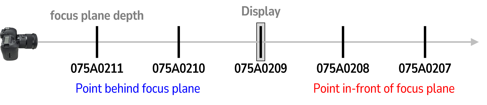

## KAIST Dual-Pixel Blur Kernel (Circle of Confusion)

We provide captured spatially-varying circle of confusion (blur kernel) of dual-pixel camera. See our paper and supplemental material for detail of our experiment setup.

You can download it from [Google drive](https://drive.google.com/drive/folders/1yXAR4WNuic5HuLrp2D4tFo7esdLrkais?usp=sharing).

### Directory structure

- `raw/*.CR2`: Captured raw images. Canon CR2 format.
- `separated/*_*.tif`: Separated dual-pixel center, left, right from `raw/` using Canon official software (Digital Photo Professional). Additional LZW compression applied.
- `adjusted/*_*.tif`: Apply adjustments from `separated/`. Color to 8-bit grayscale, black level adjustment and curve adjustment (tone mapping) is used. Note that adjustments are manually done and differ by image (but same for each left/right). Although this is not the strict way, here we show the split symmetry of the circle of confusion.
- `single/*_*.png`: Cropped near principal-axis blur kernel from `adjusted/`.
- `target.png`: Dot pattern used for experiment, spatial resolution 3840x2160.

### File name

There are 5 ids, 075A0207 - 075A0211. See the following figure.

